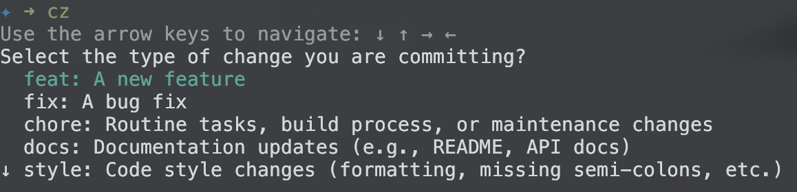

# cz - Commit Management CLI

`cz` is a command-line tool that helps developers craft well-structured commit messages. It provides an interactive experience for selecting commit types, scopes, and writing commit messages. The tool aims to make the process of creating consistent, semantic commit messages easier and more user-friendly.

It is inspired by [commitizen](https://commitizen-tools.github.io/commitizen/)

## Features

- **Interactive Prompts**: Guides the user through a series of prompts to create well-structured commit messages.
- **Commit Types**: Support for standard commit types such as `feat`, `fix`, `docs`, `style`, and more.
- **Scope Selection**: Allows users to specify the scope of the commit, such as a module or feature.
- **Commit Message Generation**: Generates commit messages based on user input using a customizable template.

## Installation

To install `cz`, you can either clone the repository and build it yourself or use pre-built binaries.

### Clone the repository and build

```bash
git clone https://github.com/rockingrohit9639/cz.git
cd cz
go build
```

### Pre-built Binaries

Check latest release [here](https://github.com/rockingrohit9639/cz/releases)

## Usage

Once installed, you can use cz to create commit messages. Here's an example of how to use the tool:

### Commit Command

To start creating a commit message, run:

```sh
cz
```

The tool will guide you through the following prompts:

Commit Type: Select the type of commit (e.g., feat, fix, docs).
Scope: Optionally specify the scope of the commit.
Message: Write the main commit message.
Body: Add an optional body to provide more details about the commit.



After completing the prompts, you will see a preview of the generated commit message. You can then confirm and proceed with committing the changes.

### Undo command

The undo command reverts the last commit while keeping the changes unstaged, allowing you to modify and recommit if needed.

Usage:

```sh
cz undo
```

### Add Command

The add command stages all modified, deleted, and new files, preparing them for commit. It's equivalent to running `git add .`

Usage:

```sh
cz add
```

### Get previous commit message

This command retrives the last commit message done with cz.

Usage:

```sh
cz get-prev-commit
```

### Add Format

This command adds a new commit format in config. You can later use this to format your new commit messages.

Usage:

```sh
cz add-format
```

## Contributing

We welcome contributions! Feel free to open issues, submit pull requests, or suggest improvements.

- Fork the repository
- Create a new branch (git checkout -b feat/some-feature)
- Commit your changes (use our `cz` tool 😄)
- Push to the branch (git push origin feat/some-feature)
- Open a pull request

## License

This project is licensed under the MIT License - see the [LICENSE](./LICENSE) file for details.

## Future Plans

- [x] Add flags for type, scope, and message to override interactive prompts.
- [x] Add retry feature for commit creation.
- [x] Add undo command to revert the last commit.
- [x] Warn if no changes are staged
- [x] Add command to stage all changes
- [x] Support for commit templates.
- [ ] Enhancements to the user interface (e.g., improved color schemes).
- [x] Preview commit message and only commit after confirmation.
- [ ] Implement `.czrc` file
