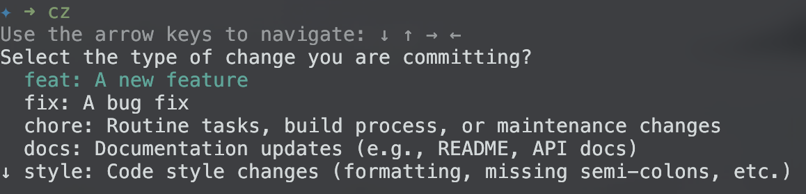

# cz - Commit Management CLI

`cz` is a command-line tool that helps developers craft well-structured commit messages. It provides an interactive experience for selecting commit types, scopes, and writing commit messages. The tool aims to make the process of creating consistent, semantic commit messages easier and more user-friendly.

It is inspired by [commitizen](https://commitizen-tools.github.io/commitizen/)

## Features

- **Interactive Prompts**: Guides the user through a series of prompts to create well-structured commit messages.
- **Commit Types**: Support for standard commit types such as `feat`, `fix`, `docs`, `style`, and more.
- **Scope Selection**: Allows users to specify the scope of the commit, such as a module or feature.
- **Commit Message Generation**: Generates commit messages based on user input using a customizable template.

## Installation

Pick whichever line matches your setup — none of them require downloading a binary by hand.

### macOS / Linux — Homebrew

```sh
brew install rockingrohit9639/tap/cz
```

Upgrade later with `brew upgrade cz`.

### Windows — Scoop

```powershell
scoop bucket add rockingrohit9639 https://github.com/rockingrohit9639/scoop-bucket
scoop install cz
```

Upgrade later with `scoop update cz`.

### macOS / Linux — install script

For machines without Homebrew. Installs to `/usr/local/bin`, falling back to
`~/.local/bin` when that is not writable.

```sh
curl -sSfL https://raw.githubusercontent.com/rockingrohit9639/cz/main/install.sh | sh
```

Pin a version or change the location with environment variables:

```sh
curl -sSfL https://raw.githubusercontent.com/rockingrohit9639/cz/main/install.sh \
  | CZ_VERSION=v2.0.0 CZ_INSTALL_DIR="$HOME/bin" sh
```

### Windows — install script

For machines without Scoop. Installs to `%LOCALAPPDATA%\cz\bin` and adds it to
your user `PATH`.

```powershell
irm https://raw.githubusercontent.com/rockingrohit9639/cz/main/install.ps1 | iex
```

Pin a version or change the location by setting `$env:CZ_VERSION` /
`$env:CZ_INSTALL_DIR` before running it.

### Go

```sh
go install github.com/rockingrohit9639/cz@latest
```

### Manual download

Prebuilt archives for Linux, macOS, and Windows (amd64 and arm64) are attached to
every [release](https://github.com/rockingrohit9639/cz/releases), along with a
`checksums.txt` to verify them.

### Build from source

```bash
git clone https://github.com/rockingrohit9639/cz.git
cd cz
go build
```

### Verify the install

```sh
cz version
```

## Usage

Once installed, you can use cz to create commit messages. Here's an example of how to use the tool:

### Commit Command

To start creating a commit message, run:

```sh
cz
```

The tool will guide you through the following prompts:

Commit Type: Select the type of commit (e.g., feat, fix, docs).
Scope: Optionally specify the scope of the commit.
Message: Write the main commit message.
Body: Add an optional body to provide more details about the commit.



After completing the prompts, you will see a preview of the generated commit message. You can then confirm and proceed with committing the changes.

### Undo command

The undo command reverts the last commit while keeping the changes unstaged, allowing you to modify and recommit if needed.

Usage:

```sh
cz undo
```

### Add Command

The add command stages all modified, deleted, and new files, preparing them for commit. It's equivalent to running `git add .`

Usage:

```sh
cz add
```

### Get previous commit message

This command retrives the last commit message done with cz.

Usage:

```sh
cz get-prev-commit
```

### Add Format

This command adds a new commit format in config. You can later use this to format your new commit messages.

Usage:

```sh
cz add-format
```

### Version

Prints the version, commit, and build date of your `cz` binary. Useful when reporting issues.

```sh
cz version
```

## Releasing (maintainers)

Releases are fully automated by [GoReleaser](https://goreleaser.com). Cutting one is:

```sh
git tag v2.1.0
git push origin v2.1.0
```

The `Release` workflow then builds all six binaries (linux/darwin/windows x amd64/arm64),
publishes the GitHub release with checksums and a generated changelog, and pushes the
updated Homebrew cask and Scoop manifest to the tap repositories.

### One-time setup

1. Create two **public** repositories under the same account:
   - `homebrew-tap` — receives `Casks/cz.rb`
   - `scoop-bucket` — receives `bucket/cz.json`
2. Create a GitHub personal access token that can write to both:
   - Classic token with the `repo` scope, or
   - Fine-grained token scoped to those two repos with **Contents: read and write**
3. Add it to this repository as the secret `GORELEASER_TOKEN`
   (Settings → Secrets and variables → Actions → New repository secret).

The built-in `GITHUB_TOKEN` publishes the release itself but cannot write to other
repositories, which is why the extra token is required.

### Testing the release locally

```sh
goreleaser check
goreleaser release --snapshot --clean --skip=publish
```

Artifacts land in `dist/`. Every pull request also runs this dry run in CI, so a broken
`.goreleaser.yaml` is caught before you tag.

## Contributing

We welcome contributions! Feel free to open issues, submit pull requests, or suggest improvements.

- Fork the repository
- Create a new branch (git checkout -b feat/some-feature)
- Commit your changes (use our `cz` tool 😄)
- Push to the branch (git push origin feat/some-feature)
- Open a pull request

## License

This project is licensed under the MIT License - see the [LICENSE](./LICENSE) file for details.

## Future Plans

- [x] Add flags for type, scope, and message to override interactive prompts.
- [x] Add retry feature for commit creation.
- [x] Add undo command to revert the last commit.
- [x] Warn if no changes are staged
- [x] Add command to stage all changes
- [x] Support for commit templates.
- [ ] Enhancements to the user interface (e.g., improved color schemes).
- [x] Preview commit message and only commit after confirmation.
- [ ] Implement `.czrc` file
- [ ] Create command to set default commit format
